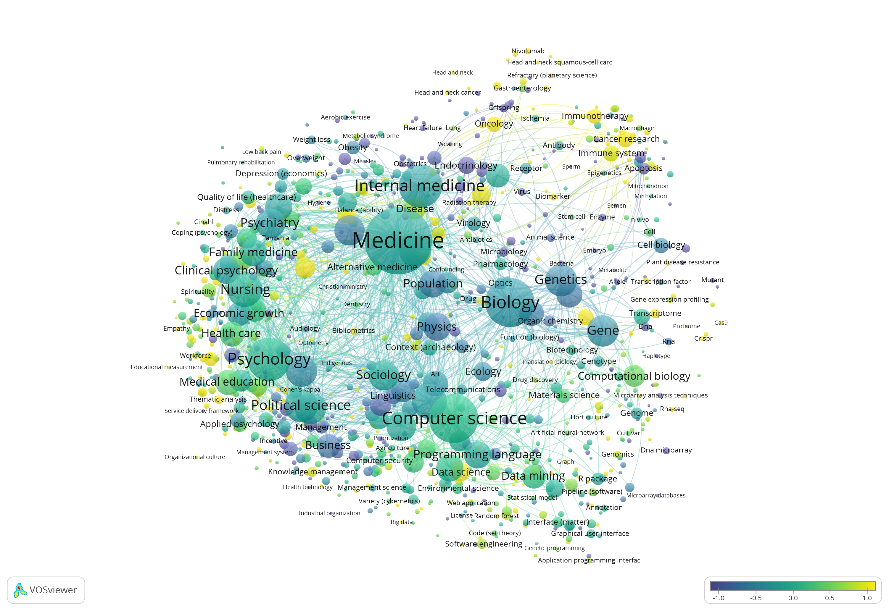

# R Basics for Medical Research

## Introduction

This tutorial introduces R programming basics specifically tailored for medical research. We'll cover essential concepts using Posit Cloud and RStudio, following best practices from established R education resources [@Sanchez2024_RIntro].

### Learning Objectives

By the end of this tutorial, you will be able to:

- Navigate the Posit Cloud interface
- Understand basic R syntax
- Perform simple data analysis
- Create basic visualizations

## Log in to Posit Cloud

To get started with R, first access Posit Cloud:

👉 [Log in to Posit Cloud](https://login.posit.cloud/login)

1. Enter your account credentials
2. If you don't have an account:
   - Click "Sign Up"
   - Complete the registration form
   - Verify your email address
3. After logging in, click "New Project" → "New RStudio Project"

Once logged in, you'll be ready to create and run R projects directly in your browser.

## R 

R is a powerful programming language for statistical computing and graphics [@Sanchez2024_RIntro]. Key features include:

- Open-source and free to use
- Extensive package ecosystem (over 18,000 packages)
- Strong community support
- Excellent data visualization capabilities

## RStudio

***Figure 1.** RStudio interface demonstrating the four main working panels: Source Editor, Console, Environment/History, and Files/Plots/Packages/Help (adapted from [1]).*

RStudio is an integrated development environment (IDE) that makes working with R easier [1]. The interface includes:

1. **Source Editor**: For writing and editing scripts
2. **Console**: For executing commands and viewing output
3. **Environment/History**: For viewing variables and command history
4. **Files/Plots/Packages/Help**: For managing files, viewing plots, and accessing documentation

## First Steps in RStudio

## References

1. Sanchez G. Getting started with R and RStudio [Internet]. Berkeley (CA): University of California, Berkeley, Department of Statistics; 2024 [cited 2024 Jan 1]. (STAT 133: Concepts in Computing with Data). Available from: https://stat133.berkeley.edu/spring-2024/slides/stat133-00-intro2-RStudio.pdf. Creative Commons Attribution-ShareAlike 4.0 International License (CC BY-SA 4.0)

