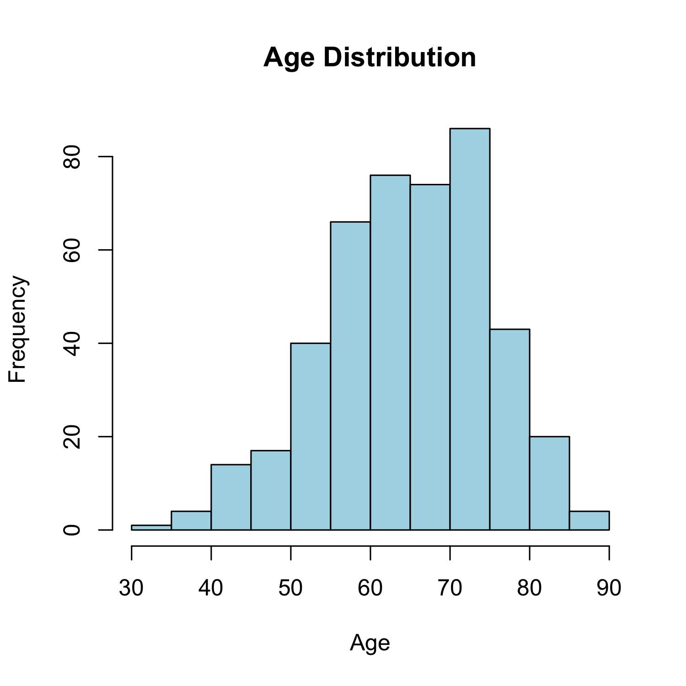
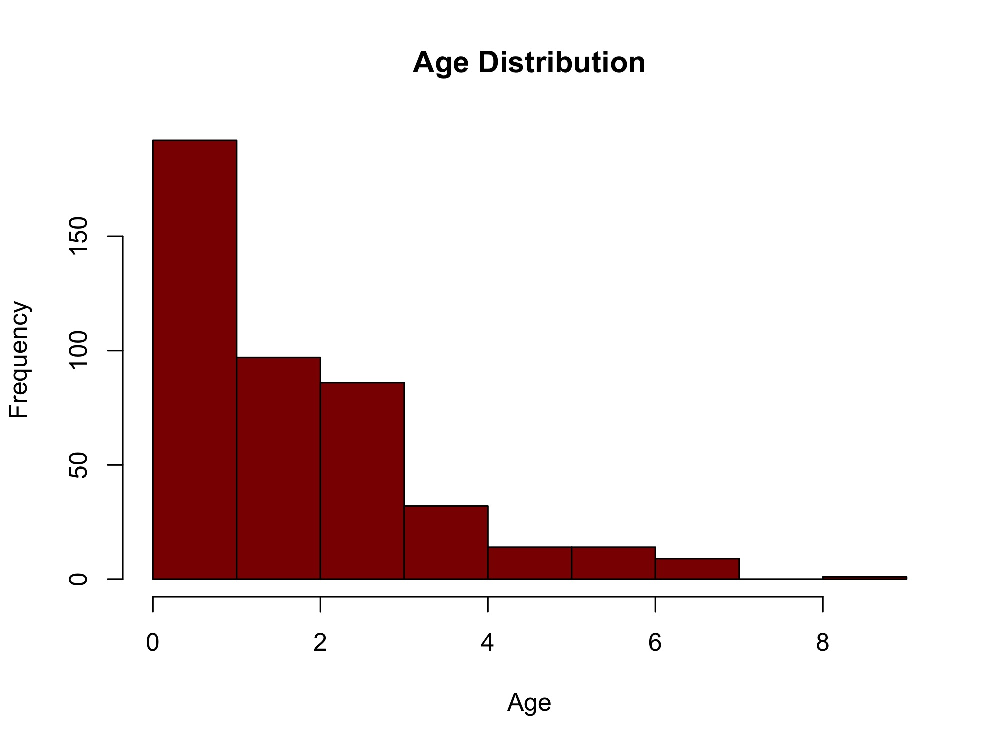
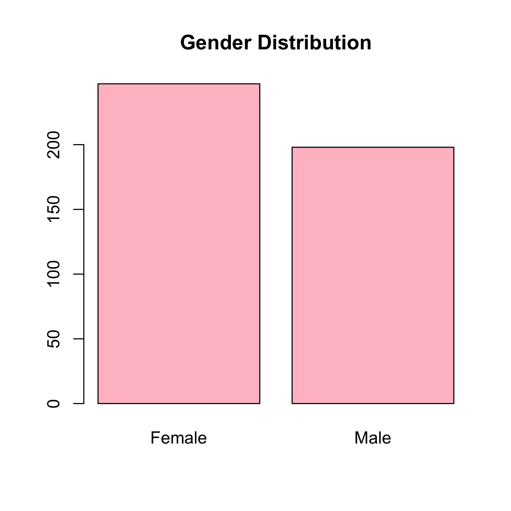
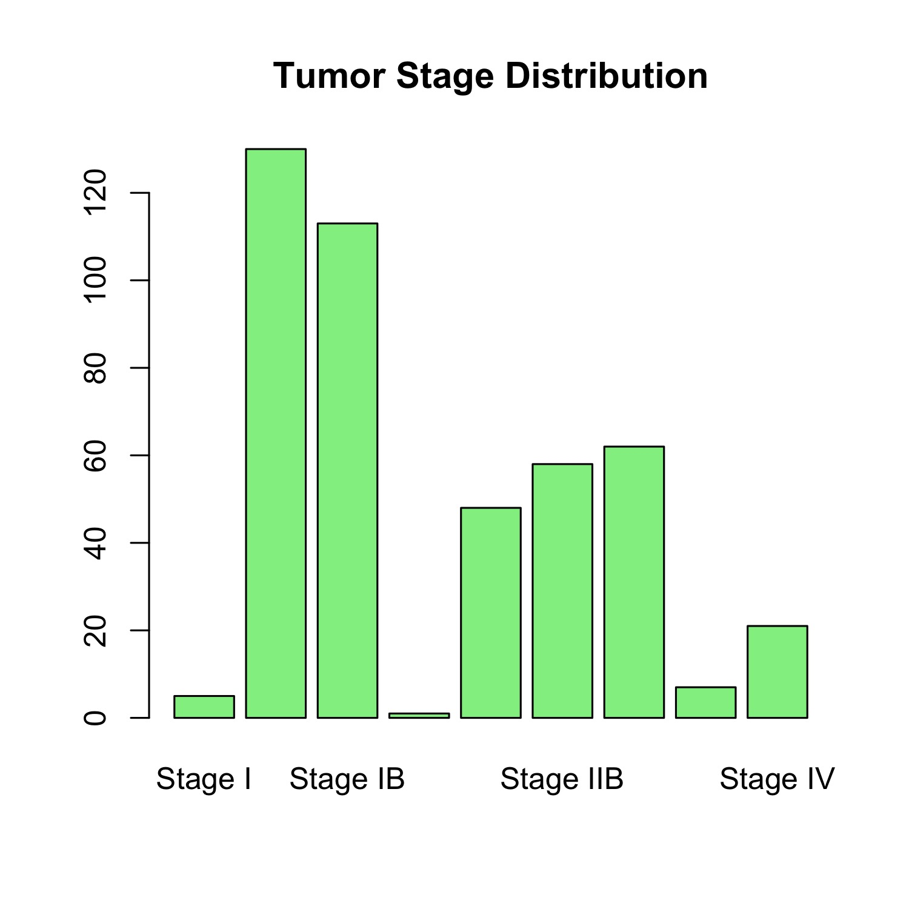
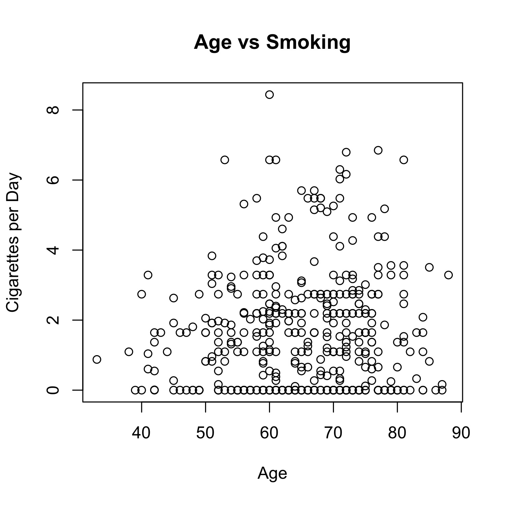
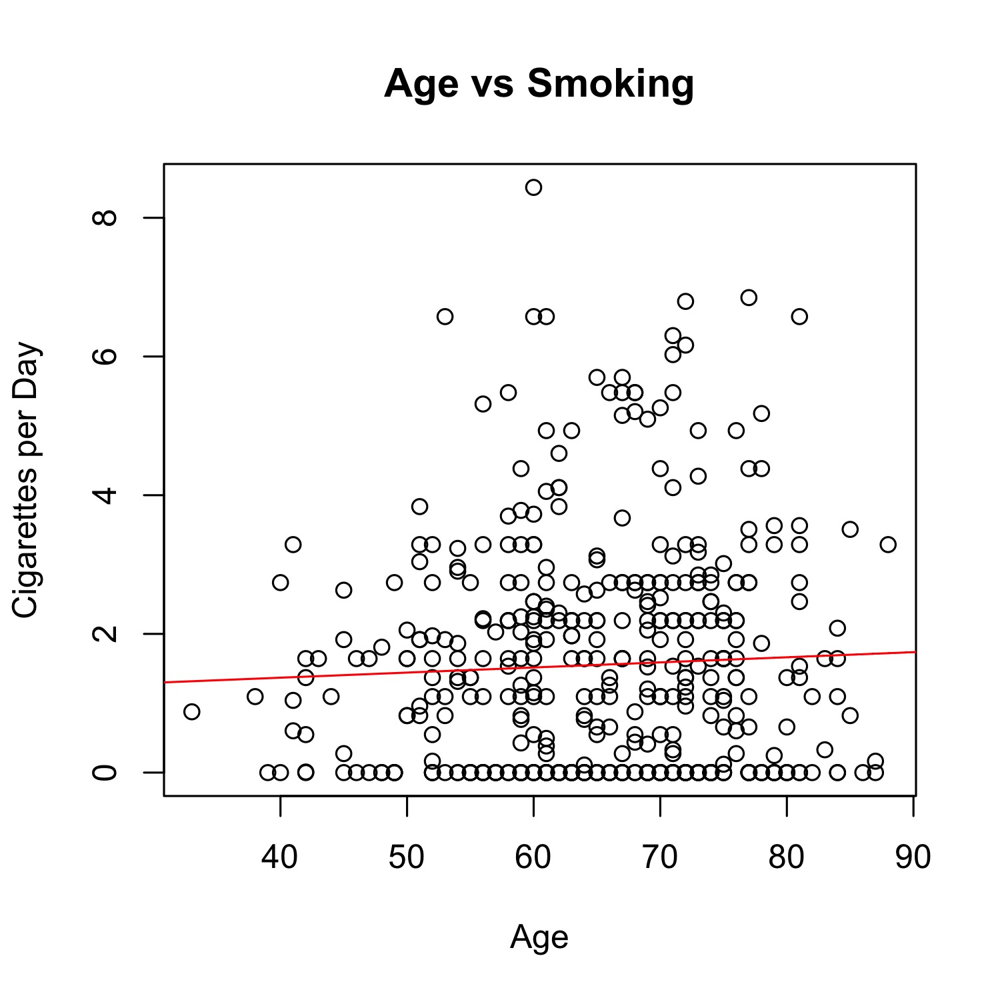
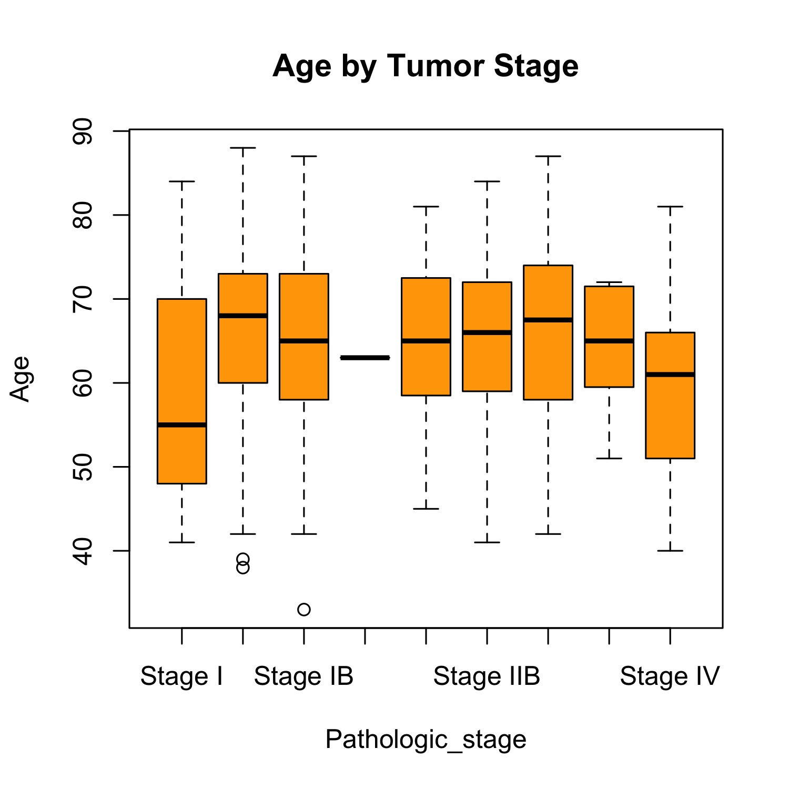
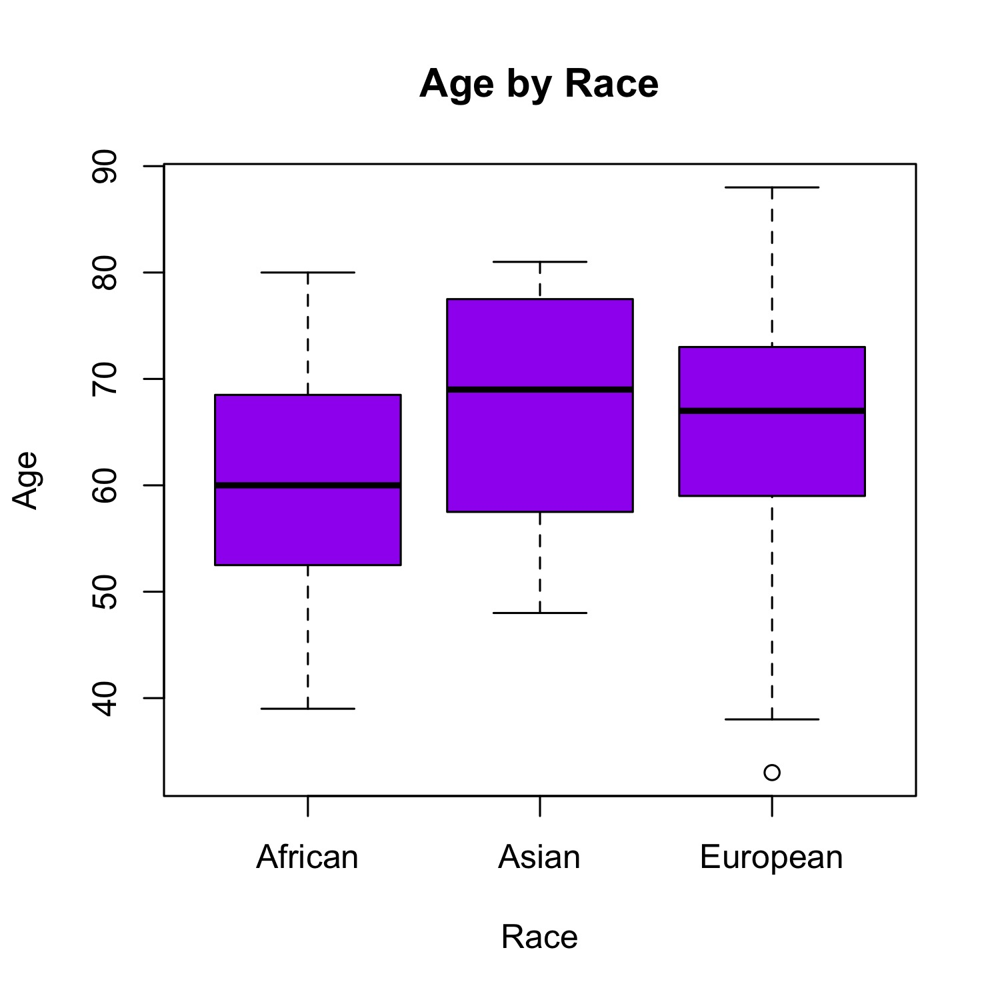

---
# 🫁 LUAD (Lung Adenocarcinoma) Data Analysis in R

---

## 📌 1. Introduction  
Lung Adenocarcinoma (LUAD) is one of the most common types of lung cancer and a leading cause of cancer-related mortality worldwide. Analyzing clinical and demographic patient data helps identify disease patterns, risk factors, and supports better treatment strategies.

In this tutorial, we will work with a LUAD dataset containing variables such as age, gender, smoking status, tumor stage, and race. The goal is to perform data loading, cleaning, exploration, and basic statistical analysis using R.

---

## 📥 2. Download the Dataset  

The dataset used in this tutorial is publicly available.

🔗 **Dataset Source:**  
https://github.com/Manojbioinfo/R_basic_course/blob/main/Data/LUAD_clean_data_all_patients.csv  

👉 Click the link → select **"Raw"** → right-click → **Save As** to download the file.  

Place the file in your R working directory before proceeding.

---

## 📌 3. Workspace Preparation  

```r
# Clear workspace
rm(list = ls())
```

**Interpretation:**  
This ensures a clean working environment and avoids conflicts with previously stored variables.

---

## 📦 4. Load Required Libraries  

```r
# Install (run once only)
# install.packages("tidyverse")

# Load library
library(tidyverse)
```


Below message is **automatically printed by R when you load tidyverse**. 


```
── Attaching core tidyverse packages ───────────────── tidyverse 2.0.0 ──
✔ dplyr     1.2.1     ✔ readr     2.2.0
✔ forcats   1.0.1     ✔ stringr   1.6.0
✔ ggplot2   4.0.2     ✔ tibble    3.3.1
✔ lubridate 1.9.5     ✔ tidyr     1.3.2
✔ purrr     1.2.1     

── Conflicts ───────────────────────── tidyverse_conflicts() ──
✖ dplyr::filter() masks stats::filter()
✖ dplyr::lag()    masks stats::lag()
ℹ Use the conflicted package to force all conflicts to become errors
```


**Interpretation:**  
The tidyverse package provides tools for data manipulation, analysis, and visualization.

This output confirms that the tidyverse package and its core components have been successfully loaded.  

The “conflicts” message indicates that some functions (such as `filter()` and `lag()`) from dplyr override functions with the same name from base R (stats package). This is normal and does not cause errors in most analyses.


---

## 📂 5. Load the Dataset  

```r
# Load dataset
Data <- read.csv("LUAD_clean_data_all_patients.csv")
```

---
## 🔍 Preview of the Dataset

```r
# View first few rows of the dataset
head(Data)
```

**Output:**  
```
           ID Age Gender     Race Vital_Status Pathologic_stage Cigarettes_per_day Age_Group
1 TCGA-55-A48X  63 Female European        Alive        Stage IIA          1.9726027     Young
2 TCGA-NJ-A55R  67   Male European        Alive         Stage IA          0.2739726       Old
3 TCGA-53-A4EZ  63   Male European        Alive        Stage IIA          2.1917808     Young
4 TCGA-44-6777  85 Female European         Dead         Stage IB          3.5068493       Old
5 TCGA-55-6982  79 Female European         Dead        Stage IIB          0.0000000       Old
6 TCGA-50-7109  60   Male European         Dead         Stage IA          6.5753425     Young
```

**Interpretation:**  
The `head()` function displays the first six observations of the dataset, providing a quick overview of the data structure and values.  

From this preview, we can confirm that:
- The variables are properly organized and readable  
- Both numerical and categorical data are present  
This step helps verify data quality before proceeding with analysis.

---

## 🔍 Inspecting the Dataset Structure

```r
# Inspect structure of the dataset
str(Data)
```

**Output:**  
```
'data.frame': 579 obs. of  8 variables:
 $ ID                 : chr  "TCGA-55-A48X" "TCGA-NJ-A55R" ...
 $ Age                : int  63 67 63 85 ...
 $ Gender             : chr  "Female" "Male" ...
 $ Race               : chr  "European" "European" ...
 $ Vital_Status       : chr  "Alive" "Alive" ...
 $ Pathologic_stage   : chr  "Stage IIA" "Stage IA" ...
 $ Cigarettes_per_day : num  1.973 0.274 2.192 ...
 $ Age_Group          : chr  "Young" "Old" ...
```

**Interpretation:**  
The dataset contains **579 observations and 8 variables**.  

- **Numerical variables:** Age, Cigarettes_per_day  
- **Categorical variables:** Gender, Race, Vital_Status, Pathologic_stage, Age_Group  
- **Identifier variable:** ID  

Most categorical variables are currently stored as character type and should be converted to factors for proper analysis. The dataset appears clean and suitable for further statistical analysis.

---
## 🔍 Summary Statistics of the Dataset

```r
# Summary of the dataset
summary(Data)
```

**Output:**  
```
      ID                 Age          Gender              Race           Vital_Status       Pathologic_stage  
 Length:579         Min.   :33.0   Length:579         Length:579         Length:579         Length:579        
 Class :character   1st Qu.:59.0   Class :character   Class :character   Class :character   Class :character  
 Mode  :character   Median :66.0   Mode  :character   Mode  :character   Mode  :character   Mode  :character  
                    Mean   :65.2                                                                              
                    3rd Qu.:72.0                                                                              
                    Max.   :88.0                                                                              
 Cigarettes_per_day  Age_Group        
 Min.   :0.000      Length:579        
 1st Qu.:0.000      Class :character  
 Median :1.096      Mode  :character  
 Mean   :1.512                        
 3rd Qu.:2.466                        
 Max.   :8.438       
```

**Interpretation:**  
The `summary()` function provides an overview of both numerical and categorical variables in the dataset.

- **Age:**  
  The average age is **65.2 years**, with values ranging from **33 to 88 years**. The median age (66) is close to the mean, suggesting a fairly symmetric distribution.

- **Cigarettes per day:**  
  The mean is **1.51**, while the median is **1.10**, indicating a slightly right-skewed distribution. A minimum of 0 suggests that some individuals do not smoke.

- **Categorical variables (Gender, Race, Vital_Status, Pathologic_stage, Age_Group):**  
  These are currently stored as character variables and summarized by their length rather than frequencies, indicating the need for conversion to factors for better analysis.

Overall, the dataset appears consistent, with no obvious missing values shown in the summary, and is suitable for further statistical analysis after minor preprocessing.

---

## 🧹 6. Data Cleaning  

### 🔍 Check for Missing Values

Before starting any analysis, it’s important to check if your dataset contains missing values.

#### ▶️ Run the following code:

```r
# Check missing values in each column
colSums(is.na(Data))
```

#### ✅ Output:

```r
                ID                Age             Gender               Race       Vital_Status   Pathologic_stage Cigarettes_per_day          Age_Group 
                 0                  0                  0                  0                  0                  0                  0                  0 
```

---

### ✅ Interpretation

- Each column shows **0 missing values**
- This means your dataset is **complete**
- No need for data cleaning related to missing values


## 📊 7. Descriptive Statistics  

```r
# Mean age
mean(Data$Age)
```
#### ✅ Output:
```
65.23371
```


```r
# Median age
median(Data$Age)
```
#### ✅ Output:
```
66
```


```r
# Frequency tables of gender 
table(Data$Gender)
```

#### ✅ Output:
```
Female   Male 
   247    198 
```

```r
# Frequency tables of pathological stage
table(Data$Pathologic_stage)
```

#### ✅ Output:
```
Stage I   Stage IA   Stage IB   Stage II  Stage IIA  Stage IIB Stage IIIA Stage IIIB   Stage IV 
         5        130        113          1         48         58         62          7         21 
```


**Interpretation:**  
Descriptive statistics summarize the main characteristics of the dataset and help understand distributions.

---

## 📈 8. Data Visualization  

```r
# Histogram of Age distribution
hist(Data$Age,
     col = "lightblue",
     main = "Age Distribution",
     xlab = "Age")
```



```r
# Histogram of Cigarettes per day
hist(Data$Cigarettes_per_day,
     col = "tomato",
     main = "Cigarettes_per_day Distribution",
     xlab = "Cigarettes_per_day")

```



```r
# Bar plots
barplot(table(Data$Gender),
        col = "pink",
        main = "Gender Distribution")
```



```r
barplot(table(Data$Tumor_Stage),
        col = "lightgreen",
        main = "Tumor Stage Distribution")
```


**Interpretation:**  

Visualizations provide an intuitive understanding of data patterns and distributions.

---

## 📉 9. Relationship Analysis  

```r
# Scatter plot
plot(Data$Age, Data$Smoking,
     xlab = "Age",
     ylab = "Cigarettes per Day",
     main = "Age vs Smoking")
```



```r
# Regression line
abline(lm(Smoking ~ Age, data = Data), col = "red")
```


**Interpretation:** 

This explores the relationship between age and smoking behavior, helping identify trends.

---

## 📊 10. Correlation Analysis  

```r
cor(Data$Age, Data$Smoking, use = "complete.obs")
```

```
0.04594092
```

**Interpretation:**  
Correlation measures the strength and direction of association between two numerical variables.  

Values range from -1 to +1:  
- Close to +1 → strong positive relationship  
- Close to -1 → strong negative relationship  
- Close to 0 → no relationship  

Our result, i.e, 0.04594092 means:

> As **age increases, cigarettes per day *very slightly* increase**, but the relationship is so weak that it’s basically **no real relationship at all**.

So:

> There is a negligible positive relationship between age and cigarettes per day, indicating essentially no meaningful association.
---

## 📦 11. Boxplots  

```r
# Age by Tumor Stage
boxplot(Age ~ Tumor_Stage, data = Data,
        col = "orange",
        main = "Age by Tumor Stage")
```



```r
# Age by Race
boxplot(Age ~ Race, data = Data,
        col = "purple",
        main = "Age by Race")
```


**Interpretation:**  
Boxplots compare distributions across groups and help detect variability and outliers.

---

## 💾 12. Saving Output  

```r
jpeg("luad_plot.jpg", width = 2000, height = 1500, res = 300)

boxplot(Age ~ Race, data = Data,
        col = "purple",
        main = "Age by Race")

dev.off()

```

**Interpretation:**  
This allows saving visual outputs for reports and presentations. The above plot will be saved as luad_plot.jpg in the current working directory

---

## 🔧 13. Reproducibility  

```r
sessionInfo()
```

**Interpretation:**  
Records R environment details to ensure the analysis can be reproduced.

---

## ✅ 14. Conclusion  
This tutorial demonstrated a complete workflow for analyzing LUAD clinical data in R. The process included data downloading, cleaning, descriptive analysis, visualization, and basic statistical methods.

The results provide insights into patient characteristics and relationships between variables such as age and smoking. This structured approach ensures accurate, reproducible, and meaningful analysis of healthcare datasets.

